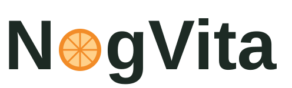
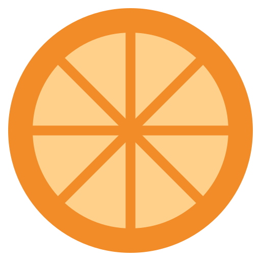

<p align="center">
  <picture>
    <source media="(prefers-color-scheme: dark)" srcset="docs/assets/logo-dark.svg">
    
  </picture>
</p>

# NogVita

Plataforma de acompanhamento nutricional que conecta **pacientes**, **nutricionistas** e **administradores**.

O paciente encontra um nutricionista e solicita acompanhamento. O nutricionista monta planos alimentares com cálculo nutricional automático, baseado em uma fonte externa de dados nutricionais.

> 🚧 **Projeto de estudo em desenvolvimento.** Criado para praticar .NET, arquitetura e engenharia de software.

## Funcionalidades

### Implementadas

- **Autenticação com JWT:** login, token de acesso de curta duração e endpoint de usuário autenticado
- **Refresh token:** renovação com rotação, detecção de reuso e logout
- **Papéis combináveis:** um mesmo usuário pode ser paciente, nutricionista e/ou administrador
- **Administrador inicial** criado automaticamente a partir da configuração
- **Validação de entrada:** requisições inválidas respondem 400 com os erros por campo
- **CPF validado:** normalização e verificação matemática dos dígitos verificadores
- **Política de senha** baseada na recomendação do NIST (SP 800-63B-4)
- **Cadastro de paciente:** conta e perfil em uma única etapa, com login automático
- **Perfil do paciente:** consulta e atualização dos próprios dados, com idade calculada
- **Painel do administrador:** listagens paginadas de usuários, pacientes e nutricionistas, com busca e filtros
- **Ativação e desativação de contas:** desativar revoga todas as sessões do usuário

### Em desenvolvimento

- Gestão de nutricionistas pelo administrador, com convite
- Solicitações de acompanhamento
- Planos alimentares com cálculo nutricional
- Registro de peso

## Endpoints

| Método | Rota | Descrição |
|---|---|---|
| `POST` | `/api/v1/auth/login` | Autentica e devolve os tokens |
| `POST` | `/api/v1/auth/refresh` | Renova os tokens (com rotação) |
| `POST` | `/api/v1/auth/logout` | Encerra a sessão |
| `GET` | `/api/v1/auth/me` | Dados do usuário autenticado |
| `GET` | `/health` | Saúde da API e do banco |
| `POST` | `/api/v1/auth/register/patient` | Cadastra um paciente e devolve os tokens |
| `GET` | `/api/v1/patients/me` | Perfil do paciente autenticado |
| `PUT` | `/api/v1/patients/me` | Atualiza o perfil do paciente autenticado |
| `GET` | `/api/v1/admin/users` | Lista usuários (paginado, com busca e filtro) |
| `GET` | `/api/v1/admin/users/{id}` | Detalhes de um usuário |
| `POST` | `/api/v1/admin/users/{id}/deactivate` | Desativa a conta e revoga as sessões |
| `POST` | `/api/v1/admin/users/{id}/activate` | Reativa a conta |
| `GET` | `/api/v1/admin/patients` | Lista pacientes (paginado) |
| `GET` | `/api/v1/admin/patients/{id}` | Detalhes de um paciente |
| `GET` | `/api/v1/admin/nutritionists` | Lista nutricionistas (paginado) |
| `GET` | `/api/v1/admin/nutritionists/{id}` | Detalhes de um nutricionista |

## Stack

**Em uso:** C# · .NET 10 · ASP.NET Core Web API · Entity Framework Core · PostgreSQL · JWT · FluentValidation · xUnit · Docker (banco de dados) · OpenAPI / Swagger UI

**Planejado:** Docker Compose (API + banco) · testes de integração

## Arquitetura

Clean Architecture em quatro camadas:

```
src/
├── NogVita.Api              → exposição HTTP
├── NogVita.Application      → casos de uso e validação de entrada
├── NogVita.Domain           → entidades, value objects e regras de negócio
└── NogVita.Infrastructure   → banco de dados, segurança e integrações externas

tests/
├── NogVita.UnitTests
└── NogVita.IntegrationTests
```

**Regra de dependência:** o Domain não depende de nenhuma outra camada nem de pacotes externos. A Application define contratos (repositórios, hash de senha, geração de tokens), e a Infrastructure os implementa.

**Duas camadas de validação:**
- **Entrada (FluentValidation):** verifica se a requisição está bem preenchida e devolve todos os erros de uma vez
- **Domínio (entidades e value objects):** garante que nenhum objeto inválido exista, como um CPF com dígitos verificadores errados

**Leitura e escrita separadas (CQRS leve):** as operações que alteram dados passam por casos de uso e pelas regras do domínio. As listagens usam serviços de consulta que projetam direto do banco para o DTO, com paginação e sem carregar entidades inteiras.

## Segurança

- Senhas armazenadas com PBKDF2 (HMAC-SHA512, 100 mil iterações)
- Política de senha do NIST: mínimo de 15 caracteres, sem regras de composição e com lista de bloqueio
- Refresh tokens armazenados apenas como hash SHA-256
- Mesma resposta para qualquer falha de login, evitando enumeração de usuários
- Limite de tamanho em senhas e tokens, protegendo o servidor contra entradas gigantes
- Segredos fora do código (User Secrets em desenvolvimento)
- Nenhum dado pessoal nos tokens nem nos logs
- Autorização por papel (`Patient`, `Nutritionist`, `Admin`) e acesso aos próprios dados sempre pelo token, nunca por Ids enviados pelo cliente
- Conflitos de cadastro com mensagem genérica, sem revelar se um CPF ou e-mail já tem conta (LGPD)

## Identidade visual



O logotipo é só o nome, com o "o" trocado por uma fatia de laranja. A fatia sozinha também funciona como ícone do app.

<br clear="left">

| Cor | Hex | Uso |
|---|---|---|
|  Laranja | `#F28C28` | Casca e gomos da fatia |
|  Polpa | `#FFD08A` | Interior da fatia |
|  Verde-escuro | `#1D2A24` | Texto do logotipo |

Os arquivos ficam em [`docs/assets/`](docs/assets/): `logo.svg` (fundo claro), `logo-dark.svg` (fundo escuro) e `icon.svg` (ícone).

## Como rodar (desenvolvimento)

**Pré-requisitos:** .NET SDK 10 e Docker.

1. Suba o PostgreSQL:

   ```bash
   docker run -d --name nogvita-postgres -e "POSTGRES_USER=nogvita" -e "POSTGRES_PASSWORD=<senha>" -e "POSTGRES_DB=nogvita" -p 127.0.0.1:5432:5432 -v nogvita-pgdata:/var/lib/postgresql/data postgres:17
   ```

2. Configure os segredos com `dotnet user-secrets` no projeto `src/NogVita.Api`:
   - `ConnectionStrings:NogVita`
   - `Jwt:SecretKey` (32 bytes aleatórios, em base64)
   - `AdminSeed:Name`, `AdminSeed:Email`, `AdminSeed:Cpf` (CPF válido), `AdminSeed:Password` (mínimo de 15 caracteres)

3. Restaure as ferramentas e aplique as migrations:

   ```bash
   dotnet tool restore
   dotnet ef database update --project src/NogVita.Infrastructure --startup-project src/NogVita.Api
   ```

4. Rode a API:

   ```bash
   dotnet run --project src/NogVita.Api --launch-profile https
   ```

5. Acesse o Swagger em `https://localhost:7194/swagger`
